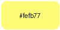

# Neutral Dark (WIP)

`Disclaimer`: Neutral dark is WIP  Themes may be broken or incomplete , extensive testing has not been performed. If you find a bug please fix it and submit a pull request.

## About

Neutral Dark is design guideline and theme library. It provides a sleek appearance with a card based layout, neutral background and vibrant colors.

## Preview

TODO: Update vscode preview to reflect syntax highlighting

## Specifications

Some themes may not implement all specifications either because the theme is incomplete or the application does not support advanced customizations.

### Fonts

| Type      | Font                                               |
| --------- | -------------------------------------------------- |
| UI        | [Inter](https://fonts.google.com/specimen/Inter)   |
| Monospace | [JetBrainMono](https://www.jetbrains.com/lp/mono/) |

### Spacing and layout

| Property | Value | Description                |
| -------- | ----- | -------------------------- |
| `gap`    | 5px   | Gap Between Major Sections |
| `radius` | 8px   | Radius of Cards            |

### Color Palette

| Color              | Hex                                                                                                      | Swatch                                                       | Usage                                                             |
| ------------------ | -------------------------------------------------------------------------------------------------------- | ------------------------------------------------------------ | ----------------------------------------------------------------- |
| Text               |
| `Text`             | 
#ffffff
   |                          | Basic text, Headers                                               |
| `Subtext`          | 
#aaaaaa
 |                    | Subtext, Placeholder, Comments                                    |
| `Hidden`           | 
#606060
 |                      | Disabled, Hidden                                                  |
| Backgrounds        |
| `base`             | 
#000000
   |                          | Window backgrounds                                                |
| `section`          | 
#111111
   |                    | Major Section, Content Only Window                                |
| `card`             | 
#181818
   |                            | Card, Input, Semihighlighted button                               |
| `overlay`          | 
#222222
   |                    | Search Overlay,                                                   |
| Customizations     |
| `accent`           | 
#a386ff
   |                      | Custamizable Primary Accent                                       |
| `accent-secondary` | 
#83bbff
   |  | Customization Secondary Accent                                    |
| `accent-tertiary`  | 
#fefb77
   |    | Customization Tertiary Accent                                     |
| Colors             |
| `Red`              | 
#fe5970
   |                            | Error, Remove, Close, Delete, Tags (HTML/XML), Annotations        |
| `Orange`           | 
#ffa062
   |                      | Warning, Numbers                                                  |
| `Yellow`           | 
#fefb77
   |                      | Info, Help                                                        |
| `Green`            | 
#99ff82
   |                        | Strings                                                           |
| `Teal`             | 
#80ffc1
   |                          | Success, New, Add,                                                |
| `Cyan`             | 
#7ef8fe
   |                          | Attributes, Properties (HTML/CSS/JSX)                             |
| `Blue`             | 
#83bbff
   |                          | Neutral, Function Names, Declarations                             |
| `Purple`           | 
#a386ff
   |                      | Modified, Change, Edit, Keywords, Reserved Words, Important Terms |
| `Pink`             | 
#fe99fe
   |                          | Operators (+, -, \*, etc.)                                        |
| `White`            | 
#ffffff
   |                        |                                                                   |
| `Black`            | 
#000000
   |                        |                                                                   |

### Additional Options

Some themes may have additional options such as layout changes, colors, etc. If a theme has additonal option they will be listed in the theme's `README.md` file.

## Usage

Search the themes folder for your desired application or website. Once you have found it follow the instilation instructions in the README.md file. If your application is not list consider making a theme and submitting a pull request.

### NixOS

If your using nixos check out my [nix configs](https://github.com/RiaruAzaki/nix-configs) which comes with application themed with neutral dark.
